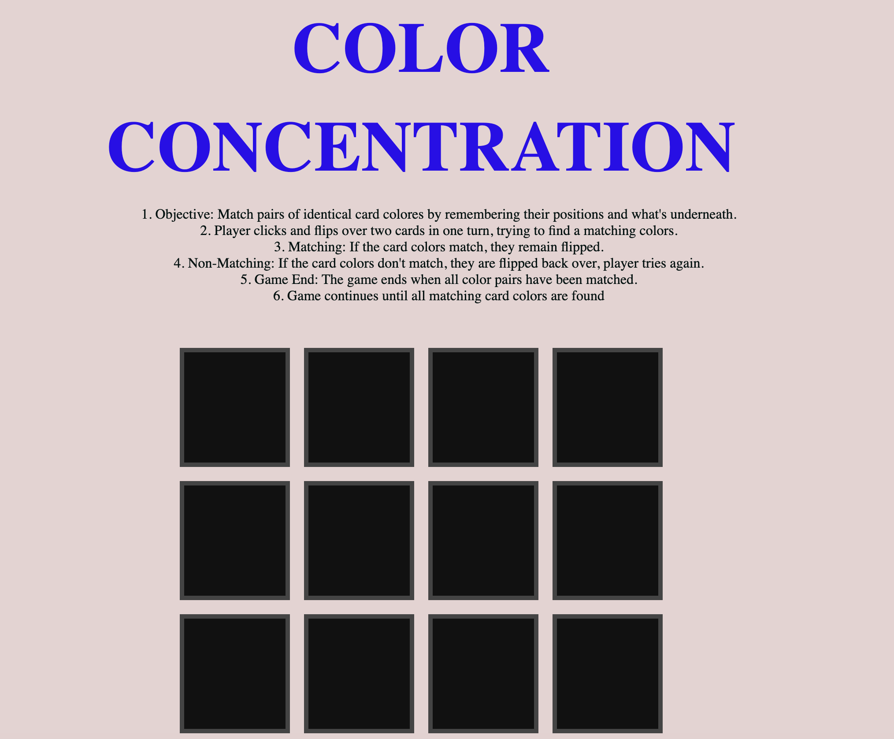

# Game Introdution - COLOR CONCENTRATION

### Game Inspiration:
I like rainbows and wanted to make the game a rainbow themed matching game. Fell a little short on the rainbow but was able to incorporate all the rainbow colors for my tiles to be matched. 

### Game Summary/Play:

**Objective:** Match pairs of identical card colors by remembering their positions and what's underneath.

* Player clicks and flips over two cards in one turn, trying to find a matching colors.

* Matching: If the card colors match, they remain flipped.

* Non-Matching: If the card colors don't match, they are flipped back over, player tries again.

* Game End: The game ends when all color pairs have been matched.

* Game continues until all matching card colors are found

### Pseudo Code:

1) Define the required variables used to track the state of the game.

2) Store cached element references.

3) Upon loading, the game state should be initialized, and a function should 
//   be called to render this game state.

4) The state of the game should be rendered to the user.

5) Define the required constants.

6) Handle a player clicking a square with a function to turn over the tile and remain turned over.

6) a. Handle a player clicking a square with a function to turn over next tile and determine if colors match.

6) b. if colors match remain turned over. go back up to step 6 and repeat. 

7) State a win when all color tiles have been matched and reamin turned over. 

### Technologies Used:

* CSS
* HTML
* Javascript
* MacBook

### NEXT STEPS: 

Due to some medical issues I would have liked to have spent more time refining my game and program.

### Special Acknowledgment: 

My Wife for helping me type while my arm is in a sling after surgery.

Bin Zhu - A Software Dev that works at the same compnay as I do (USAA). We also went to high school together. 

